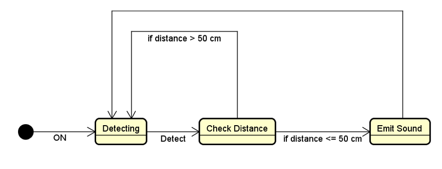

-----------------------------------------------------------------------------------------------------------------------------

# Distance Detector :camel: :camel: :camel: 

## CAO1 :metal: :metal: :metal: 

#### Michal Ciebien, 266908 
#### Mihai Tirtara, 266097
#### Nikita Roskovs, 266900
#### Cristian Guba, 254104 
   ### _Supervisor: Jesper Kehlet Bangsholt_
   ### _CAO1, Semester III, 10/31/2018_
   
   
   
   Table of content

* Abstract
1. Introduction	
2. Requirements	
   2.1 Functional Requirements	
   2.2 Non-Functional Requirements	
3. Analysis	
4. Design	
5. Implementation	
6. Test	
   6.1Test Specifications	
7. Results and Discussion	
8. Conclusions
9. Project future	
10. Sources of information	
11. Appendices	

__Abstract__

*This project involves a detailed introduction through the development stages of the Distance detector, that involves audio* *feedack. The process started with making the concept of how our device is going to work, based on our working kit which is* *adruino starting pack. The next step was to write a requirements list and optimize it regarding ATMEGA 2560 possibilities.* *Based on our requirements list we made our diagrams so we can rely on them to write the code which was written in AVR* *assembly. After testing our code and analysing its behaviour we tested every possible overflow or errors based on* *requirements list, we edited it so we do not get out of reqiorements bounds.*

# __1 Introduction__

@ !--------Mihai Tirtara -------!

The purpose of the introduction is to provide background information and set the scene for your project. Within which business or organization are you doing the project? Who are the stakeholders and who is the customer?
The background information is adapted from your project description where you have already described the problem domain. Describe the current situation and existing context. Your statements must be supported by references to reliable and relevant sources. 

This should lead to why this project is relevant and outline your aim and objectives. Which technical problems and challenges will be presented in this report, again taken from your project description. System illustrations and rich pictures are welcome here.

State delimitations relevant for your project in the introduction. Delimitations include what the project will not cover in relation to your project description, i.e. what could have been expected in your project. Remember that you can only make delimitations to aspects mentioned in the project description and you must argue well for your delimitations.
The last sentences of the introduction should be an overview of the sections to follow. This will be a good transition to the next sections.

Remember: You must ensure a clear connection between sections in the project report, from Project Description, Requirements, Analysis, Design, Implementation to Test. This means that everything that is implemented can be found in design, everything that is designed is based on the analysis, and anything that is found in analysis has a clear link to requirements, etc.

# __2	Requirements__

### __2.1 Functional requirements__

1. The device should emit sound if it gets close to the object
2.	The sound emission frequency rate should be dependent on the distance from the object

### __2.2	Non-Functional Requirements__

1.	The device should be built using Arduino AVR and basic components
2.	The device should be programmed using Assembly language

# __3	Analysis__

@ !--------Cristian Cuba -------!

In the analysis part we discuss the work of the device on the conceptual level. We refer to UML diagrams and class discussions in order to get a better overview of how the device should later be designed and implemented.

# __3. 1.1	State-machine diagrams__

We start our analysis with discussing the workflow of the machine.

            Figure 1 Distance Detector UML State-Machine Diagram
            
The above diagram shows us the paths device can take after it’s turned on. It starts with the Detecting state, which is responsible for detection initiations. The following state is Check Distance, which verifies the distance between the object and device. If the distance is bigger than fifty centimetres, the state goes back to Detecting. On the other hand if it is smaller than fifty centimetres the state changes to Emit Sound. 

We then dive more deeply into the first of the above states – Detecting. 

            Figure 2 Ultrasonic Sensor UML State-Machine Diagram
            
After getting into the first state, Wait For Trigger, the Sensor waits until it gets a pulse of at least 10uS. After receiving the triggering pulse, the state changes to Send Pulse, which will send a ultrasonic pulse and wait for the response. If the pulse doesn’t comes back, the state comes back to Wait For Trigger, otherwise it forwards to Out High For Time, which will send a high level output for the duration of time from sending ultrasonic pulse to returning.

# __4	Design__

@ !--------Michal Ciebien -------!

The device design was based on previously made diagrams and discussions. The design was split into different parts which will further be highlited in this chapter. 

The design of the device has begun with defining the needed components for building the device. This included:
- AVR Buzzer
- Ultrasonic Ranging Module HC - SR04
- Breadboard
- AVR ATmega2560 microcontroller
- cables.

The decision to use interrupts (for avr input from sensor) and timers partly define the final components connections, as well as the, PINs in the controller that the components have to be connected to. The decision has been made to use:
- Timer1/Counter - for counting the wave length of the sensor
- External Interrupt 0 (INT0) - to interrupt the device and start caunting the sensor's wave length

PINs on the ports were therefore assigned as follows:

- PORTA:
   - PA0 - trigger for the sensor
   - PA2 - output for the buzzer
- PORTD:
   - PD0 - (INT0) output from the sensor
   
In order to use interrupts,
; i.e. to transform the artefacts of the analysis into a model that can be implemented. The design section is relevant for the programmer, whereas the analysis is relevant for the stakeholder.

Elements that may be relevant in this section:

*Architecture: Find architecture patterns here (Leszek Maciaszek 2004, chap.9).
*Technologies: Describe technologies used, also alternative technologies. Argue for choice of technology according to the project aim.
*Design Patterns: Describe which design patterns (GoF (Gamma et al. 2002) etc.) you are using and why.
*Class Diagrams
*Interaction Diagrams
*UI design choices
*Data models, persistence, etc.

You must explain all diagrams in the report. These diagrams including descriptions are the blueprints for the implementation.
Hint: One way to figure out which objects/classes are needed in the design is to apply the General Responsibility Assignment Software Patterns/principles (GRASP) (Larman 2004, chap.17).
Hint: Consider how to design your system to make it testable.

# __5	Implementation__

@ !-------- Michal Ciebien -------!
The purpose of the implementation section is to explain interesting code snippets. An idea is to explain the complete path through your system from UI to database etc.
Remember that your implementation must be consistent with your design (Larman 2004, chap.20).
Which standard libraries are used? How are design patterns implemented, etc.
Hint: Implement your code in a testable manner.
 
# __6	Test__

@ !-------- Nikita Roskovs -------!

The purpose of the test section is to document the result of your testing; to verify if the content of the requirements section has been fulfilled. How is the system tested, which strategy has been used; e.g. White Box (Unit Test), Black Box, etc.

# __7	Results and Discussion__

The purpose of the results and discussion section is to present the outcome and achieved results of the project.

# __8	Conclusions__

The purpose of the conclusion section is to compile the results from each section in the report. What is the conclusion? Did the project fulfil the requirements? Etc.

You can only comment on report contents, no new topics or content can be introduced in this section.

# __9	Project future__

@ !-------- Nikita Roskovs -------!

Reflect on your project from a technical viewpoint and describe what you would change if you could.

Suggest how the project could be improved or made ready for production. Discuss scalability, suggest possible spin offs, what is needed, missing, etc.?

# __10	Sources of information__

@ !-------- Michal CIebien -------!

# __11	Appendices__

The purpose of your appendices is to provide extra information to the expert reader. List the appendices in order of mention.
Examples of appendices
•	Project Description
•	User Guide
•	Source code – source documentation
•	Diagrams
•	Data sheets
•	Etc.

