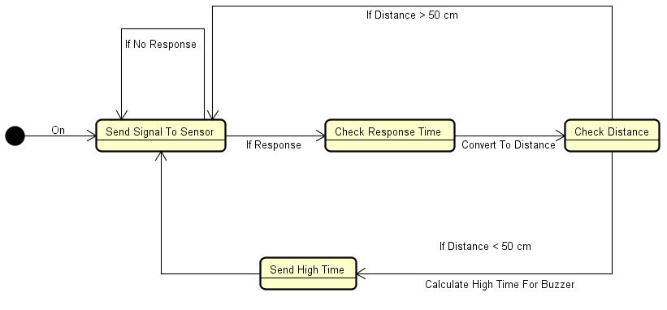
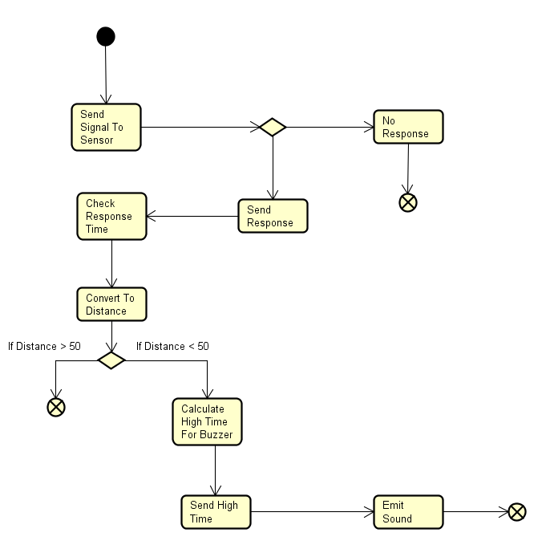

-----------------------------------------------------------------------------------------------------------------------------

# Distance Detector :camel: :camel: :camel: 

## CAO1 :metal: :metal: :metal: 


#### Michal Ciebien, 266908 
#### Mihai Tirtara, 266097
#### Nikita Roskovs, 266900
#### Cristian Guba, 254104 
   ### _Supervisor: Jesper Kehlet Bangsholt_
   ### _CAO1, Semester III, 10/31/2018_
   
   
   
   Table of content

* Abstract
1. Introduction	
2. Requirements	
   2.1 Functional Requirements	
   2.2 Non-Functional Requirements	
3. Analysis	
4. Design	
5. Implementation	
6. Test	
7. Results and Discussion	
8. Conclusions
9. Project future	
10. Sources of information	


__Abstract__

*This project involves a detailed introduction through the development stages of the Distance detector, that involves audio* *feedback. The process started with making the concept of how our device is going to work, based on our working kit which is* *arduino starting pack. The next step was to write a requirements list and optimize it regarding ATMEGA 2560 possibilities.* *Based on our requirements list we made our diagrams so we can rely on them to write the code which was written in AVR* *assembly. After testing our code and analysing its behaviour we tested every possible overflow or errors based on* *requirements list, we edited it so we do not get out of requirements bounds.*


# __1 Introduction__

   Nowadays with the advancement of technology people with special needs can significantly improve their life quality. By applying the current technologies the purpose of this project was to develop a "Blind Stick"  for persons with debilitating vision issues. A device which will emit sounds with differrent frequency depending on distance to the object. 
   The development cycle which was followed contains 4  distinct sections : Analysis, Design, Implementation and Testing, each of them being explained in greater details in the later parts of the report. Furthermore in the next topic it is presented the list of requirements.
# __2	Requirements__

### __2.1 Functional requirements__

1. The device should emit sound if it gets close to the object
2.	The sound emission frequency rate should be dependent on the distance from the object

### __2.2	Non-Functional Requirements__

1.	The device should be built using Arduino AVR (ATmega2560) and basic components
2.	The device should be programmed using Assembly language

# __3	Analysis__

@ !--------Cristian Cuba -------!


		Figure 1 State-Machine Diagram

When the device is turned on, the first action is to check the senson input, in case we do not recive anything we remain in that state until the input is recived. If the input is recived the board checks response time from the moment when the output was send until the input came. Using the formula for converting time into distance we get a precise distance between the sensor and the object which occurs. Based on distance which we recived either we get back to the first state of sending the signal to the sensor, if distance is less then 50 centimeters, or we send a signal to the buzzer after what we send the signal to sensor again.


		Figure 2 Activity Diagram
		


# __3. 1.1	State-machine diagrams__

We start our analysis with discussing the workflow of the machine.


            Figure 3 Distance Detector UML State-Machine Diagram
            
The above diagram shows us the paths device can take after it’s turned on. It starts with the Detecting state, which is responsible for detection initiations. The following state is Check Distance, which verifies the distance between the object and device. If the distance is bigger than fifty centimetres, the state goes back to Detecting. On the other hand if it is smaller than fifty centimetres the state changes to Emit Sound. 

We then dive more deeply into the first of the above states – Detecting. 


            Figure 4 Ultrasonic Sensor UML State-Machine Diagram
            
After getting into the first state, Wait For Trigger, the Sensor waits until it gets a pulse of at least 10uS. After receiving the triggering pulse, the state changes to Send Pulse, which will send a ultrasonic pulse and wait for the response. If the pulse doesn’t comes back, the state comes back to Wait For Trigger, otherwise it forwards to Out High For Time, which will send a high level output for the duration of time from sending ultrasonic pulse to returning.

# __4	Design__


The device design was based on previously made diagrams and discussions. The design was split into different parts which will further be highlited in this chapter. 

The design of the device has begun with defining the needed components for building the device. This included:
- AVR Buzzer
- Ultrasonic Ranging Module HC - SR04
- Breadboard
- AVR ATmega2560 microcontroller
- cables

**The idea of the device work at this point is to:**

1. Send an impulse to the ultrasonic sensor
2. Wait for the sensor's echo signal
3. Start the Timer/Counter at the rising edge of the signal
4. Increment the T/C as long as the signal is high
5. Read the T/C counter when the input goes low
6. Stop the T/C
7. Send high on the output pin for the buzzer
9. Delay the signal high based on the T/C counter value
10. Delay the signal low based on the T/C counter value
11. Do it again

The decision to use interrupts (for avr input from sensor) and timers partly define the final components connections, as well as the PINs in the controller that the components has to be connected to. The decision to use the following has been made:
- Timer1/Counter - for counting the wave length of the sensor
- External Interrupt 0 (INT0) - to interrupt the device and start counting the sensor's wave length

**PINs on the ports were therefore assigned as follows:**

- PORTA:
   - PA0 - trigger for the sensor
   - PA2 - output for the buzzer
- PORTD:
   - PD0 - output from the sensor, this PIN is specific to the interrupt INT0
   
In order to use interrupts, one of the pins with alternative functions has to be used, which in this case is PD0.

The technologies and software that were used in the project:
- AVR Assembly langugage
- Atmel Studio 7 IDE
 


# __5	Implementation__

The device was fully implemented in AVR Assembly language, as was stated in the previous section. The following chapter will present the intresting code snippets as well as showcase some of the crucial time calculations in larger detail.

The AVR ATmega2560 runs with 16MHz CPU. That means that each clock cycle takes ~62.5 nS.
From the Ultrasonic Sensor Datasheet, we can see that the formula for the echo high-time is as follows:
*distance (m) = high_time (s) x 340m/s/2* , after simplyfing
*high_time (s) = distance(m) / (340m/s /2)* , which gives us
*high_time ~= 0.02352941s ~ 23529 uS

Using the 16-bit Timer, we can store max. 16-bit numbers, which is 65535, and from the calculation 
*max_dist_number_to_store_by_the_timer_no_prescale = max(high_time)/one_clock_cycle_time = 235294 uS/62.5 nS = 3763200*
we can see that we would need much larger maximum storage. That's why the decision was made to use the counter with /1024 prescaling in order to be able to store the high_time value in the register.
After prescaling we can see that the max number is now *max_dist_number_to_store_by_the_timer_1024_prescale = 3763200/1024 = 3675*, which can fit into a 16-bit register.
We can divide that number by 8 to get the number that is neccesary to achieve the 0.5 meters buzzing border (after which the buzzer doesn't not emit sound buzzing), which is around 459.


```assembly
int_detect_wave_from_sensor:
	ldi r16, 0 ; 1
	out PORTA, r16 // clear PORTA completely

	ldi r20, 0b00000000 ; normal mode, int clk;
	sts TCCR1A, r20		
	ldi r20, 0b00000011 ; prescaler /1024
	sts TCCR1B, r20
	ldi r20, 0
	sts TCCR1C, r20

	loop_check_PA0:

	in r20, PIND
	sbrc r20, PD0
	rjmp loop_check_PA0 ; if PIND goes LOW, so the sensor stops it's pulse, buzz the buzzer

	lds r25, TCNT1L
	lds r26, TCNT1H
```

The above code snippet shows how the clock starts(TCCR1B), and how the value of high time is stored.
This value is then used in the delay functions to differ the frequency of the buzzing, by enlargering the delay loops.
The above function is called from an interrupt vector placed at 0x02 memory address

```assembly
 .ORG 0x02 ; vector interrupt for INT0 = 0x02
	   call int_detect_wave_from_sensor
}
```
  
that happens after the high edge from the sensor is detected - that can happen only in the following main loop:
```assembly
;----- start main
	main :
	ldi r16, 1<<PA0 ; 1
	out PORTA, r16 // Send HIGH on PA0 to start the detect and PROBABLY start interrupt
	ldi r16, 0
	out PORTA, r16 // clear the PA0
	clr r16

	call delay_detection_60ms

    rjmp main
	; ----- end main
```
In the above snippet there is also *delay_detection_60ms* function called, that is required for the accurate sensor work (as mentioned in datasheet).
 
# __6	Test__

For assessing the correctness of work the Black-box testing method was used.

Test cases:
	
	1. Object is being placed in a ultrasonic sensor range of vision. Result: Buzzer emits the sound
	2. Object located in sensors range is moving closer to the sensor. Result: Frequency of sound emitted is increasing.
	2.1 Object located in sensors range is moving farther from the sensor. Result: Frequency of sound emitted is decreasing.
	
All test cases have given the expected result. Requirements set were fulfilled	


# __7	Results and Discussion__

The result of the project is a working device with "Blind Stick" functionalities. The device responds with changing frequency of the buzzer depending on the distance from the object. The project has been done in aprox. 1,5 months.
The device is fulfilling the requirements, but does not entirely respresent the initial idea.
The idea for the device was not to emit sounds when the object is further than 50 centimeters, which is not properly implemented.
Apart from that, the device is fully functional as can be seen in Test chapter.

# __8	Conclusions__

To conclude all the previosuly highlighted topics specify the device and all the steps that were followed to build it.The proccess pattern was followed by starting with Analysis part, where the problem was analyzed and the diagrams were sketched for the further development steps. Next we took the Design part, where we relied on the analysed data and made the decisions about how the device should be implemented. In the Implementation part, the device was built and then tested.


# __9	Project future__

The first step of improving the functionality of device would be completing implementation of the sensors activity area, so the device would stop emitting sounds if the object is located farther then 50 centimeters from the sensor even if the object itself will still be in sensors range of vision.


# __10	Sources of information__

Author	Muhammad Ali Mazidi
Year published: 2010
Book title:	The AVR microcontroller and embedded systems

Datasheets:

Ultrasonic Sensor HC-SR04 - https://cdn.sparkfun.com/datasheets/Sensors/Proximity/HCSR04.pdf
AVR ATmega2560 - http://ww1.microchip.com/downloads/en/devicedoc/atmel-2549-8-bit-avr-microcontroller-atmega640-1280-1281-2560-2561_datasheet.pdf
AVR ATmega2560 Instruction Manual - http://ww1.microchip.com/downloads/en/devicedoc/atmel-0856-avr-instruction-set-manual.pdf
AVR ATmega2560 Schematic - https://www.arduino.cc/en/uploads/Main/arduino-mega2560_R3-sch.pdf

